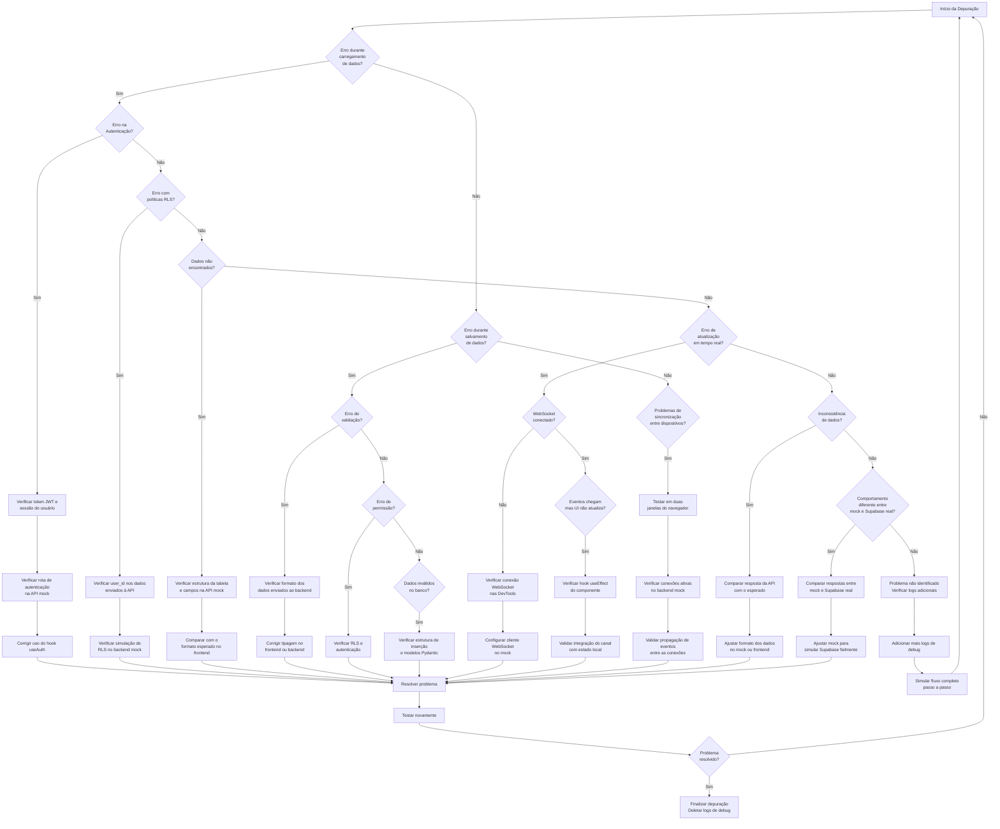

# Fluxograma de Decisão para Depuração da Refatoração Supabase

## Guia de Uso do Fluxograma

### Como Abordar Problemas durante a Depuração

1. **Identifique a categoria do problema**:
   - Problemas de carregamento de dados
   - Problemas de salvamento/atualização
   - Problemas de sincronização em tempo real
   - Inconsistências de dados

2. **Siga o caminho no fluxograma** correspondente ao tipo de problema
   
3. **Execute as ações recomendadas** em cada nó do fluxograma

4. **Teste novamente** após implementar as correções

5. **Repita o processo** se o problema persistir, adicionando mais logs de depuração

### Explicação dos Principais Nós

#### Problemas de Autenticação

Se houver problemas com autenticação, verifique:
- O token JWT está sendo gerado corretamente no backend
- O token está sendo armazenado corretamente no frontend
- O header `Authorization` está presente nas requisições

#### Problemas de RLS (Row Level Security)

Para problemas relacionados a permissões:
- Verifique se o `user_id` está sendo incluído nos dados enviados
- Confirme que a simulação de RLS no mock está funcionando
- Teste as políticas RLS com diferentes usuários

#### Problemas de WebSocket/Tempo Real

Se as atualizações em tempo real não funcionarem:
- Verifique se a conexão WebSocket foi estabelecida (DevTools > Network > WS)
- Confirme que o cliente está subscrito ao canal correto
- Verifique se os eventos estão sendo propagados para todas as conexões

#### Inconsistência de Dados

Para problemas de formato ou estrutura de dados:
- Compare a resposta da API mock com o formato esperado pelo frontend
- Verifique se todos os campos necessários estão presentes
- Ajuste o formato de dados no mock ou os modelos Pydantic

### Exemplo de Uso

1. Você detecta que os dados de hidratação não estão sendo carregados
2. Siga o fluxo de "Erro durante carregamento de dados"
3. Verifique se é um problema de autenticação, RLS ou dados não encontrados
4. Execute as ações recomendadas para o caso específico
5. Teste novamente para confirmar a resolução

Este fluxograma serve como guia para simplificar o processo de depuração, permitindo uma abordagem sistemática para resolver problemas durante a refatoração. 